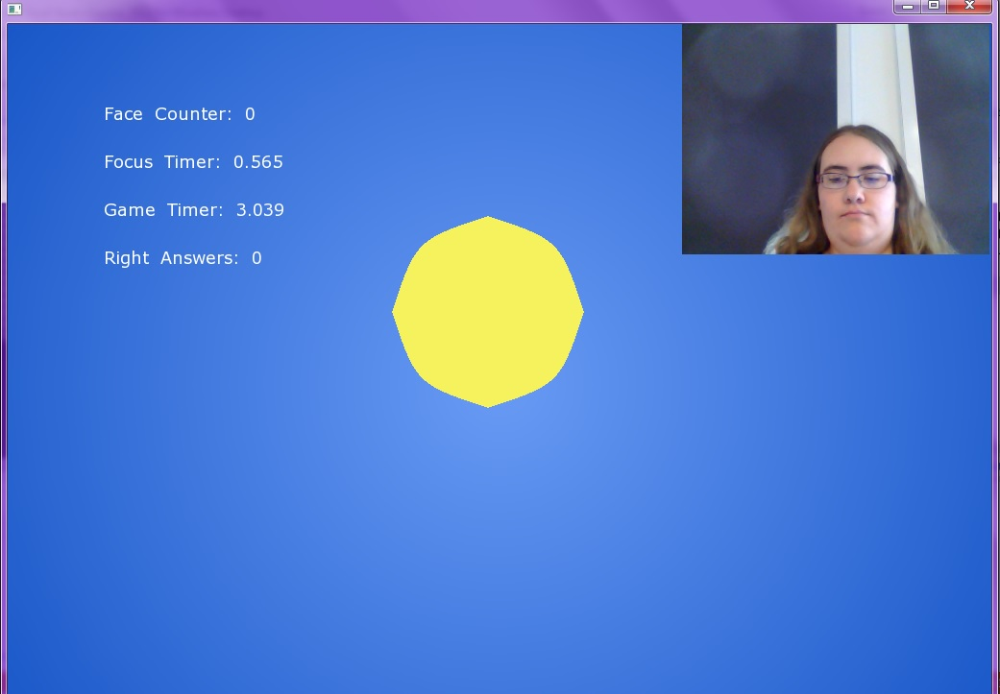
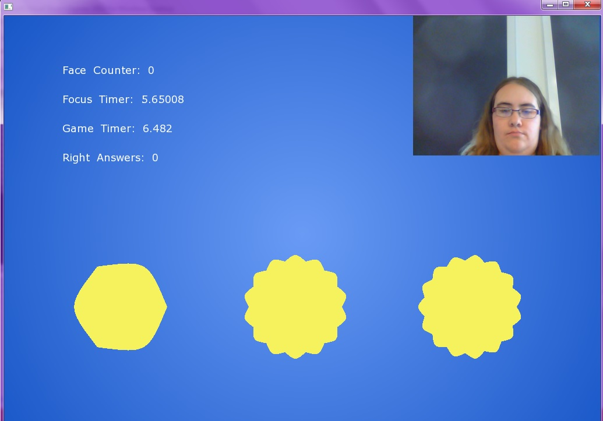
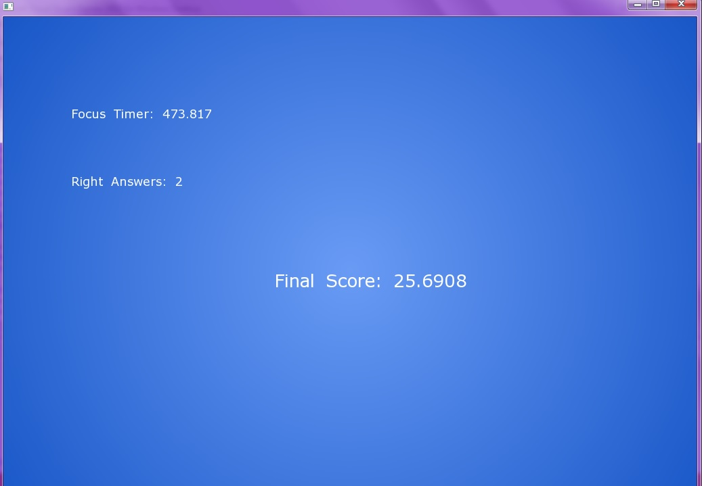

##Focus

This is a small game intended to encourage memory and staying focused on a single task for a period of time. The main audience would be children with learning disabilities (such as Autism), however, anyone can try their hand at it. The code presented here is a prototype, meant more to demonstrate what the game can possibly become with more time. 

To play the game, start up the app. The game will begin right away. You will be shown a shape for a few seconds, before it disappears and three shapes come up. One of these will be the one you were just shown. Click on it to score a point.

There will be ten such quizzes during the game. If you finish them before the minute is up, however, don't look away! The game will still be running, and you have the chance to get a bonus ("Focus Timer") added to your score the longer you stay looking at the screen. When the minute is up, your final score will be shown. 

